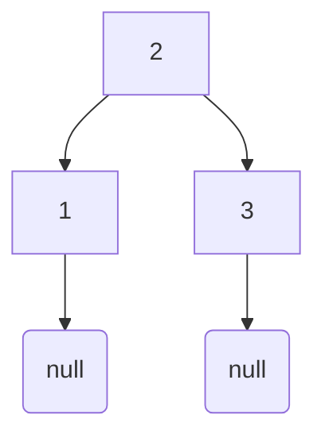
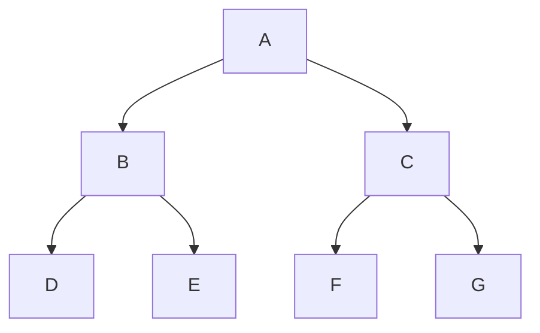

# JavaScript数据结构之树

## 实现

实现一个二叉树`Node`

```javascript
function Node(value){
    this.value = value;
    this.left = null;
    this.right = null;
}
//用法
//直接赋值
const root = new Node(2)
root.left = new Node(1)
root.left = new Node(3)
```

就会实现这样一个二叉树



## 遍历

+ 广度优先遍历
+ 深度优先遍历

### 广度优先遍历

从根节点开始一层一层的遍历,遍历他的所有子节点,然后遍历二级节点

上图遍历结果

> 2,1,3



上图的遍历结果

> A,B,C,D,E,F,G

要实现这种遍历,需要队列(先进先出)

+ 初始化一个包含根节点的队列
+ 从队列中取出第一项
+ 把取出项的左右子节点送入队列
+ 一直重复,知道队列为空

```javascript
function BFS(root){
    if(root === null){
        return ;
    }
    //初始化一个队列,包含根节点
    const queue = [root];
    //只要队列不空,那么我们都需要将队列第一项取出来,然后将子节点也放入队列
    while(queue.length){
        //首先取出队列第一项
        const item = queue.unshift()
        //做些什么
        //取出项的左右节点,放入队列中
        if(item.left) queue.push(item.left)
        if(item.right) queue.push(item.right)
    }
}
```

可以修改上面的算法,返回一个数组的数组

**其中,每个内部数组都包含一个同一层级的节点**

```javascript
function BFS(root){
    if(root === null){
        return ;
    }
    //设置一个队列,里面含有根节点
    const queue = [root]
    const ans = []
    while(queue.length){
        const len = queue.length
        const level = []
        for(let i = 0;i<len;i++){
            //取第一个元素
            const item = queue.shift()
            //将这一层的根节点包含进去
            level.push(item)
            if(item.left) queue.push(item.left)
            if(item.right) queue.push(item.right)
        }
        ans.push(level)
    }
    return ans
}
```

### 深度优先遍历

先拿到一个节点,逐层遍历子节点,直到到头

+ 前序遍历

  >根节点->左节点->右节点

+ 中序遍历

  > 左节点->根节点->右节点

+ 后序遍历

  > 左节点->右节点->根节点

#### 前序遍历

> 从根节点开始,一直往左找

递归方法

```javascript
function preorder(root){
	if(root === null){
        return ;
    }
    //去找它的子节点,然后遍历
    if(root.left) preorder(root.left)
    if(root.right) preorder(root.right)
}
```

迭代方法

类似于广度搜索,但是她这边不是队列,而是一个栈(先进后出),因为前序遍历一直是先是左边的先出来,所以我们先将右边的压入栈中

```javascript
function preOrder(root){
	if(root === null){
        return ;
    }
    while(stack.length){
        const item = stack.pop()
        //左节点要在右节点后入栈,因为先打印的是左子节点
        if(item.right) stack.push(item.right)
        if(item.left) stack.push(item.left)
    }
}
```

#### 中序遍历

> 那一个棍子,从下往上开始,从左往右移动,一次写出碰到的树的节点就是中序遍历

递归

```javascript
function Inorder(root){
    if(root===null){
        return ;
    }
    if(root.left) Inorder(root.left)
    //做一些其他什么
    if(root.right) Inorder(root.right)
}
```

迭代

```javascript
    const curr = root;
    while(curr){
        while(curr.left){
            curr = curr.left//首先先到达最左侧的子节点
        }
    }
    console.log(curr)
    curr = curr.right//找到左节点,打印完,去找他的右节点
```

我们可以用一个栈,来记录这些节点

```javascript
const stack = []
const curr = root
while(stack.length || curr){
    //首先先去找到最左的那个子节点
    while(curr){
        //将所有左节点由存入栈中
        stack.push(curr)
        curr = curr.left
    }
    cosnt leftest = stack.pop();//弹出的就是最左边的那个子节点
    console.log(leftest)
    //找到了左节点,那么就移动到右节点
    curr = leftest.right
}
```

实现迭代中序遍历

```javascript
function Inorder(root){
    if(root === null){
        return ;
    }
    const stack = []
    let curr= root
    while(stack.length || curr){
        while(curr){
            stack.push(curr)
            curr = curr.left
        }
        cosnt leftest = stack.pop()
        //做一些什么
        console.log(leftest)
        curr = leftest.right
    }
}
```

#### 后序遍历

依次去除做左边那个

> D,E,B,F,G,C,A

```javascript
function postOrder(root){
    if(root === null){
        return ;
    }
    if(root.left) postOrder(root.left)
    if(root.right) postOrder(root.right)
    //做些什么
    console.log(root.val)
}
```

迭代方法

+ 使用临时的stack,其实是左右根 ,因为stack,先进后出,所以呢我们就需要进去根,右,左
+ 将遍历的节点保存在数组result中
+ 反转result,那么就是遍历结果

```javascript
function postOrder(root){
    if(root === null){
        return ;
    }
    const stack = [root];
    const result = []
    while(stack.length){
        const last = stack.pop()
        result.push(last)
        if(last.left) stack.push(last.left)
        if(last.right) stack.push(last.right)
    }
    return result.reverse()//根左右
}
```


## 迭代器

只需要将上面的函数变为返回迭代器

```javascript
function* PreOrder(root){
   if(root === null) return

  const stack = [root]
  while(stack.length){
      const item = stack.pop()
      yield item
      if(item.right) stack.push(item.right)
      if(item.left) stack.push(item.left)
   }
}
```

